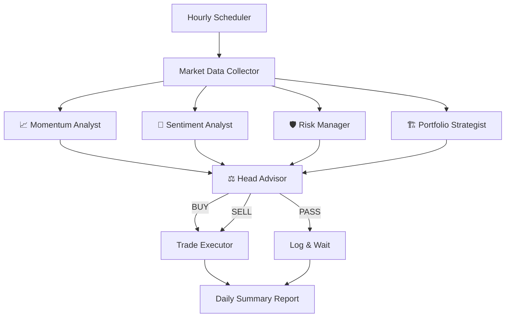
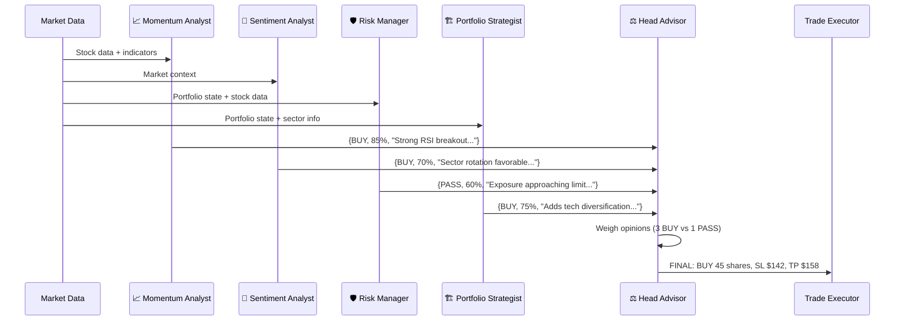

# Wealth Advisor Team — Multi-Agent Trading Bot

Transform the current single-script momentum bot into an LLM-powered multi-agent trading system where 5 GPT-4o advisors collaborate on every trade decision.

## Architecture Overview



### How It Works (Each Hourly Run)

1. **Collect Data** — Fetch 15-min bars, current positions, account info from Alpaca
2. **Specialists Analyze** — 4 advisors independently analyze each momentum candidate via GPT-4o
3. **Head Advisor Decides** — Reads all 4 opinions + data, makes final BUY / SELL / PASS decision
4. **Execute** — Trades are placed automatically on Alpaca paper account
5. **Log** — Daily summary saved at market close

---

## Proposed Changes

### Project Structure (after refactor)

```
Alpaca-Trader/
├── .env.local                  # API keys (existing)
├── config.py                   # [NEW] All trading parameters in one place
├── advisors/                   # [NEW] The advisor team
│   ├── __init__.py
│   ├── base.py                 # Base advisor class (shared GPT-4o logic)
│   ├── momentum_analyst.py     # Trend/RSI/volume analysis
│   ├── sentiment_analyst.py    # Market sentiment evaluation
│   ├── risk_manager.py         # Position sizing, exposure checks
│   ├── portfolio_strategist.py # Diversification, allocation
│   └── head_advisor.py         # Final decision maker
├── market_data.py              # [NEW] Alpaca data fetching (extracted from bot)
├── trade_executor.py           # [NEW] Order placement + position management
├── daily_summary.py            # [NEW] End-of-day summary generator
├── main.py                     # [NEW] Scheduler + main loop (replaces old bot)
└── alpaca_momentum_bot.py      # [KEEP] Original file preserved as reference
```

---

### [NEW] config.py
Central configuration file containing:
- Alpaca API credentials (from env)
- OpenAI API key (from env)
- Trading parameters: risk per trade (7.5%), stop loss (2%), take profit (5%)
- Stock universe (29 tickers: existing 26 + MU, WDC, FIX)
- Max positions: 10
- Scheduling: hourly during market hours (9:30 AM – 4:00 PM ET)

---

### [NEW] advisors/base.py
Base `Advisor` class that all advisors inherit from:
- Holds GPT-4o API call logic (using `openai` SDK)
- Each advisor has a `name`, `role`, and `system_prompt`
- `analyze(stock_data, portfolio_context) → dict` method
- Returns structured response: `{"recommendation": "BUY/SELL/PASS", "confidence": 0-100, "reasoning": "..."}`
- Temperature set to 0.3 for consistency

---

### [NEW] advisors/momentum_analyst.py
**📈 Momentum Analyst** — System prompt tuned for:
- Reading RSI values and interpreting momentum strength
- Analyzing price action patterns (higher highs, breakouts)
- Volume confirmation signals
- Identifying optimal entry timing within trending stocks

---

### [NEW] advisors/sentiment_analyst.py
**📰 Sentiment Analyst** — System prompt tuned for:
- Evaluating overall market conditions (bull/bear/neutral)
- Considering sector rotation and market themes
- Flagging macro risks (Fed decisions, geopolitical events)
- Note: Won't have live news feed — uses GPT-4o's training knowledge + market data patterns

> [!NOTE]
> GPT-4o's knowledge has a cutoff date, so this advisor reasons about market structure and patterns rather than breaking news. It still adds value by contextualizing trades within broader market dynamics.

---

### [NEW] advisors/risk_manager.py
**🛡️ Risk Manager** — System prompt tuned for:
- Portfolio exposure analysis (% in single stock, single sector)
- Max drawdown monitoring
- Position sizing recommendations based on volatility
- Flagging when the portfolio is over-concentrated
- Enforcing the max 10 positions limit

---

### [NEW] advisors/portfolio_strategist.py
**🏗️ Portfolio Strategist** — System prompt tuned for:
- Sector diversification analysis
- Correlation between existing and proposed positions
- Overall portfolio balance assessment
- Whether new positions complement or duplicate exposure

---

### [NEW] advisors/head_advisor.py
**⚖️ Head Advisor** — The decision maker:
- Receives all 4 specialist opinions for each stock
- Weighs confidence levels and consensus
- Makes final BUY / SELL / PASS decision
- Determines exact position size and stop/take-profit levels
- Returns structured JSON trade instructions

---

### [NEW] market_data.py
Extracted from current bot — clean data layer:
- `get_account()` — Account info
- `get_positions()` — Current positions
- `get_bars(symbols, timeframe, limit)` — OHLCV data
- `calculate_rsi(bars)` — Technical indicator
- `get_momentum_candidates(bars_data)` — Pre-filter for advisors

---

### [NEW] trade_executor.py
Clean trade execution:
- `execute_trade(symbol, qty, side, stop_loss, take_profit)` — Place orders with bracket logic
- `close_position(symbol)` — Exit existing position
- `check_stop_loss_take_profit(positions)` — Monitor exits
- Trade logging to `trades.json`

---

### [NEW] daily_summary.py
End-of-day summary generator:
- Generates a single GPT-4o powered daily summary
- Includes: trades made, reasons, P&L, advisor consensus stats
- Saved to `summaries/YYYY-MM-DD.md`

---

### [NEW] main.py
The orchestrator:
- Loads config + env vars
- Runs hourly loop during market hours (9:30 AM – 4:00 PM ET)
- Each cycle: collect data → run advisors → execute trades
- At market close: generate daily summary
- Graceful shutdown handling

---

## Advisor Decision Flow (per stock)



---

## Cost Estimate

| Component | GPT-4o Calls per Hourly Run | Est. Cost |
|---|---|---|
| 4 Specialist Advisors × ~5 candidates | ~20 calls | ~$0.02 |
| Head Advisor × ~5 candidates | ~5 calls | ~$0.01 |
| Daily Summary | 1 call | ~$0.005 |
| **Total per day (~7 hourly runs)** | **~175 calls** | **~$0.15–$0.25** |

---

## Verification Plan

### Automated Tests
1. Run `python3 main.py` with paper trading and verify:
   - Advisors produce valid JSON responses
   - Head Advisor makes decisions based on specialist input
   - Trades execute on Alpaca paper account
   - Daily summary generates correctly

### Manual Verification
- Review first run's advisor reasoning in logs
- Confirm positions appear in Alpaca dashboard
- Verify daily summary file is created and readable
